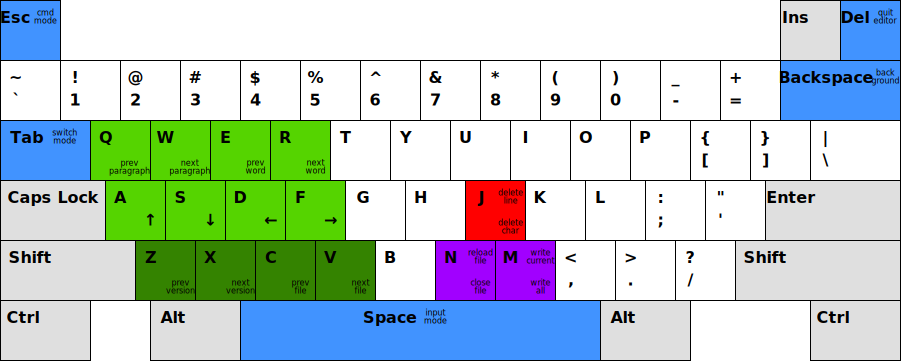

# Bare Minimum

Minimalistic text editor for GNU/Linux.

## Status

[](https://circleci.com/gh/grzegorz-zur/bm)
[](https://www.codacy.com/manual/grzegorz.zur/bm?utm_source=github.com&amp;utm_medium=referral&amp;utm_content=grzegorz-zur/bm&amp;utm_campaign=Badge_Grade)
[](https://www.codacy.com/manual/grzegorz.zur/bm?utm_source=github.com&utm_medium=referral&utm_content=grzegorz-zur/bm&utm_campaign=Badge_Coverage)

## Goals

1. Effectively work with multiple files.
2. Effectively work with external tools that modify edited files.

## Installation

To install or update run the following command.

```sh
go get -u github.com/grzegorz-zur/bm
```

## Usage

```sh
bm
```

### Command mode



### Input mode

Type to input text in the current file.

### Switch mode

Type to filter files. Navigate with cursor keys and press enter to select a file.
