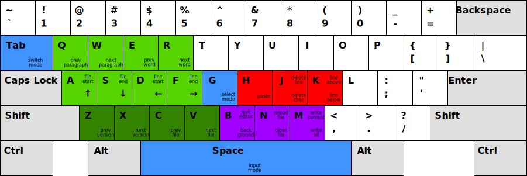
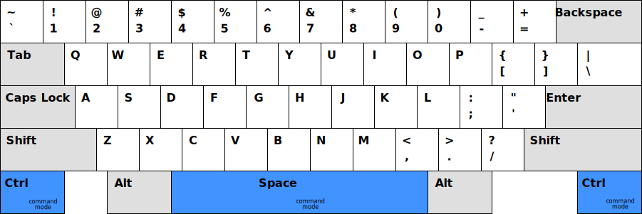
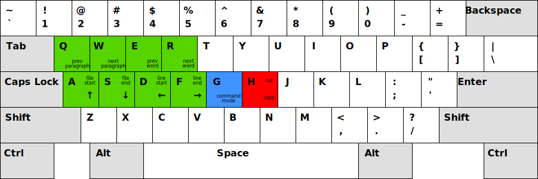
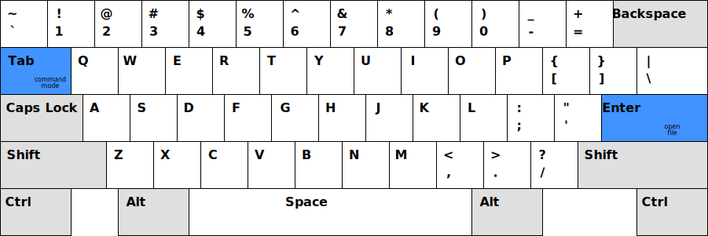

# Bare Minimum

Minimalistic text editor.

## Status

[](https://github.com/grzegorz-zur/bm/actions)
[](https://goreportcard.com/report/github.com/grzegorz-zur/bm)
[](https://codecov.io/gh/grzegorz-zur/bm)

## Goals

1.  Effectively work with multiple files.
2.  Effectively work with external tools that modify edited files.

## Installation

To install or update run the following command.

```sh
go get -u github.com/grzegorz-zur/bm
```

## Usage

```sh
bm
```

### Command mode

Execute commands.



### Input mode

Type to input text in the current file.



### Select mode

Select text and performs operation on the selection



### Switch mode

Type to filter files. Navigate with cursor keys and press enter to select a file.



