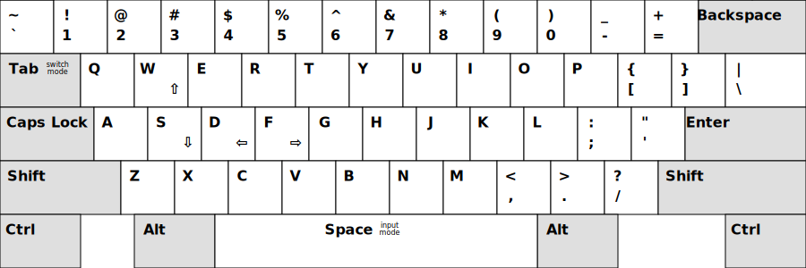

# Bare Minimum

Minimalistic text editor for GNU/Linux.

## Goals

1. Effectively work with multiple files.
2. Effectively work with external tools that modify edited files.

## Usage

### Normal mode

### Commands

* ^q — quit editor
* ^w — close current file
* ^e — write current file
* ^z — stop the editor (background)
* ^d — switch to previous file
* ^f — switch to next file

### Input mode

Type to input text in the current file.

### Switch mode

Type to filter files. Navigate with cursor keys and press enter to select a file.
